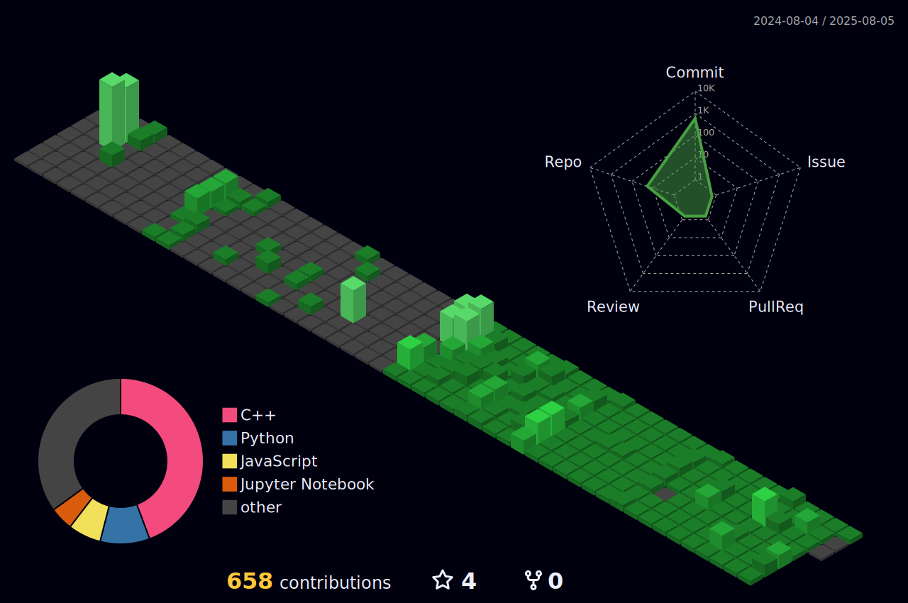

<!--
**janghyunroh/janghyunroh** is a ✨ _special_ ✨ repository because its `README.md` (this file) appears on your GitHub profile.

Here are some ideas to get you started:

- 🔭 I’m currently working on ...
- 🌱 I’m currently learning ...
- 👯 I’m looking to collaborate on ...
- 🤔 I’m looking for help with ...
- 💬 Ask me about ...
- 📫 How to reach me: ...
- 😄 Pronouns: ...
- ⚡ Fun fact: ...
-->
<!---->

# 안녕하세요! 👋
🌱저는 ML 엔지니어 / 데이터 엔지니어를 꿈꾸는 신입 개발자 **노장현**(**Brian** **Roh**)입니다.  

🧠언어모델(LM), 이상 탐지(AD), 시계열 데이터(Time-series) 등 다양한 AI 분야에 관심과 열정을 가지고 있습니다. 

👨‍🎓현재 광주과학기술원(GIST)의 지능정보시스템 연구실(IIS Lab)에서 석사 과정을 밟고 있습니다.

💻취미로 개인 블로그 개발을 위한 웹 개발을 진행 중입니다.

## GitHub Status

  
  
  
  

## 주요 관심 분야
- **기계 학습 및 심층 학습(Machine Learning & Deep Learning)**
- **자연어 처리(NLP)** 및 **언어모델(LM)**
- **개체명 인식(NER)**
- **이상치탐지(Anomaly Detection)**

## 경험 분야
- **모델 경량화(Model Compression & Distilation)**
- **디지털 트윈(Digital Twin)**
- **강화학습(RL)**

<h2 align="left">💻기술 스택(Tech Stack)</h2>

##### 주력 기술(Advanced)

  
  
  
  
  
  
  
  
  
  
  

 

##### 중급 기술(Intermediate)

  
  
  
  
  
  
  
  
  
  
  
  
  
  
  
  
  

 

##### 경험 기술(Experienced)

  
  
  
  
  
  
  
  
  
  
  
  
  
  
  
  
  

<h2 align="left"></h2>

## Contribution Summary

###

## 학력
- **서울영일고등학교 (2016 - 2018)**
- **인하대학교 컴퓨터공학과(Inha Univ, B.S. in Computer Science) (2019 - 2024)**
- **광주과학기술원 AI대학원(GIST, M.S. in AI Engineering) (2025 - 현재)**

## 개인 및 협업 프로젝트
1. **NER 시스템 개발 프로젝트(완료)**
   - BERT계열 모델 중 한국어 처리에 특화된 모델을 fine-tuning하여 특정 분야에 특화된 한국어 텍스트에서 명명된 개체를 인식하는 모델을 개발 중입니다.
   - 이전 소속 연구실의 프로젝트로, 모델 분석 및 데이터 전처리 보조와 NER 태깅 가이드라인 정립을 맡고 있습니다. 
   - Domain-specific, Task-specific한 NER이다보니 깊은 문맥 정보를 요구하는 태그가 많아 여러 연구를 진행 중입니다.
   - 2025년 이후로 연구실을 떠나면서 더 이상의 프로젝트 진행은 보류되었습니다. 

2. **챗봇 개발 프로젝트(중단)**
   - 자연어 이해(NLU)와 생성(NLG) 기술을 사용하여 대화형 AI 챗봇을 개인적으로 개발 중입니다.
   - LLaMA 모델 적용을 고려 중이며, 이를 위한 공부를 진행 중에 있습니다.
   - DeepSeek 모델의 등장으로 적용 모델을 변경할 예정입니다.
   - 단순한 챗봇 시스템의 한계를 느껴 중단하였으며, langchain과 RAG, 가능하면 MCP까지 결합하여 추후 다른 프로젝트에 적용할 예정입니다. 
  
3. **센서 등의 실시간 데이터에 대한 inference 시스템 개발 프로젝트(완료)** 
   - 네트워크 연구실 학부연구생들과 함께 협업하여 진행한 프로젝트입니다.
   - 모터에 부착된 센서의 실시간 데이터를 분석하여 이상치 처리 등의 작업을 수행합니다.
   - AutoEncoder를 이용하여 Feature Engineering을 자동화하였습니다. 
   - 최종성과발표에서 컴퓨터공학 학장상, 벤처스타트업아카데미 학회장상을 수상하였습니다.
   - 추후 진동 데이터에 대한 FFT 모듈을 추가하여 고도화를 진행할 예정입니다. 
  
4. **오픈소스 AVL Tree 라이브러리 개발 프로젝트**
   - 오픈소스 라이브러리 개발의 워크플로우를 익혀보기 위해 진행한 간단한 toy project입니다.
   - C++ 기초 지식 및 Github를 이용한 다른 개발자들과의 협업 방식을 익힌 프로젝트입니다.
     
5. **jekyll 블로그와 연동되는 RAG-based 블로그 초안 작성기**
 - 개인 블로그와 연동하여

6. ****
   
7. **기타 toy project**
   - discord, 카카오톡 등 각종 채팅 시스템에 대한 챗봇 개발
   - 개인 블로그 등 간단한 웹페이지 개발
  

## 기타 자격증 및 자기계발 경험
 - 인하대학교 소프트웨어공학(디지털트윈&학습) 연구실 학부연구생
 - 인하대학교 지능형모바일 연구실 학부연구생
   
 - 인하대학교 벤처스타트업 아카데미 사업단 활동
 - 전국 대학생 프로그래밍 동아리 연합(UCPC) 산하 인하대학교 CTP 활동 
 - 인하대학교 i-PAC 인증 콘테스트 A급 취득(2023)
 - 한국시뮬레이션학회 주관 디지털트윈교육 이수
 - ACM-ICPC Seoul Reginal 출전
 - GIST HTG 보안동아리 활동
 - AI+보안 연합해커톤 우승
   
 - SQLD 취득
 - TOEIC 960점 취득
 - TOPCIT 472점 취득
 - 2년 6개월의 해외 거주 경험 존재(New Zealand, 2011 - 2013)

대학 초반엔 학업과 학점 취득에 매진하였지만, 현재는 실무에 적용하고 프로젝트 진행에 도움될 수 있는 새로운 기술과 도구들을 공부 중입니다!
항상 꾸준히 학습하고 성장하는 것을 목표로 하고 있습니다. 깃허브를 통해 다양한 프로젝트와 코드를 공유하며, 동료 개발자들과의 협업을 통해 더 나은 결과를 만들어가고자 합니다.

저의 깃허브를 방문해주셔서 감사합니다! 언제든지 협업이나 문의가 있으시면 연락해 주세요. 😊

<h2 align="left">Contact</h2>

###

  
  
  
  
  

